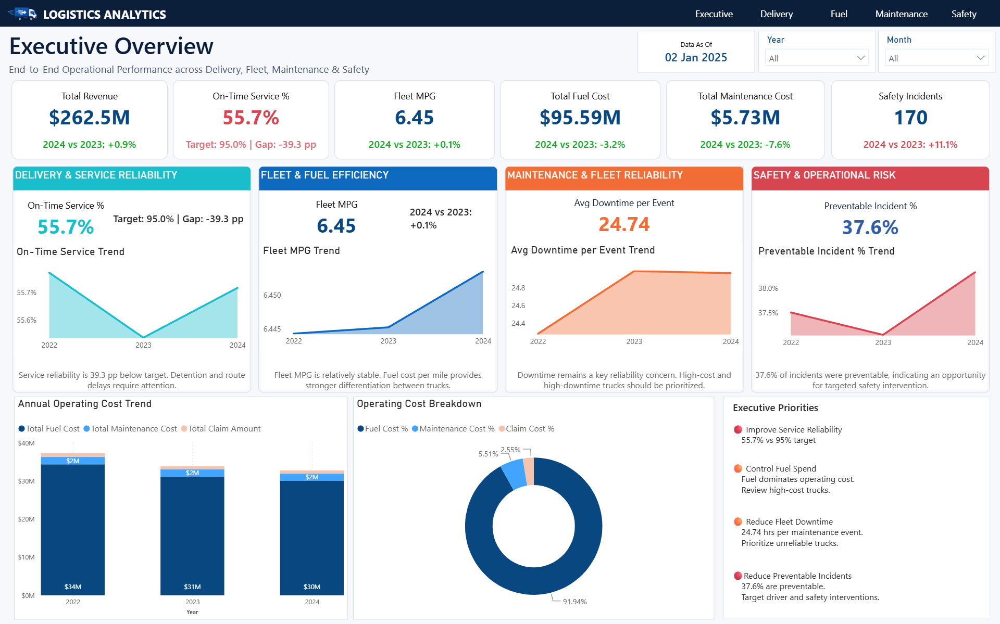
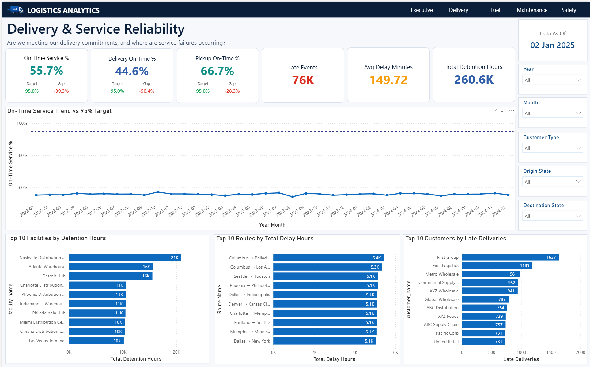
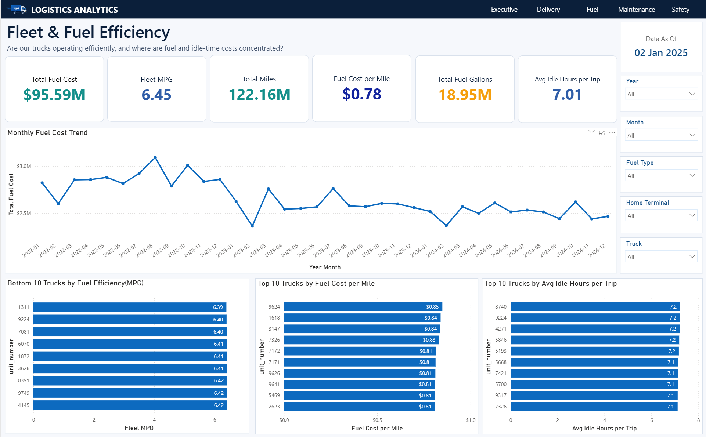
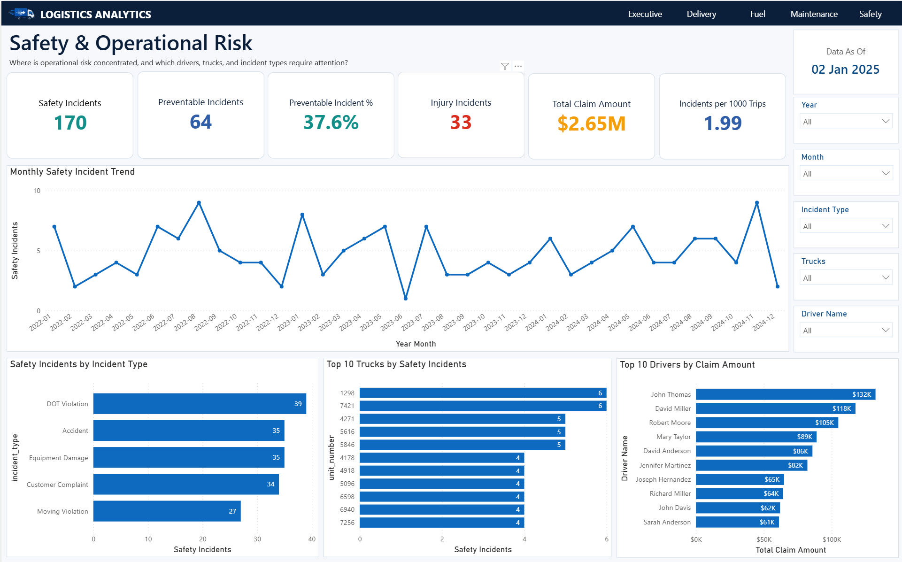

# Logistics Analytics — Power BI

## 📌 Project Overview

This project is an end-to-end **Logistics Analytics solution** built using **SQL Server and Power BI** to evaluate operational performance across delivery reliability, fleet and fuel efficiency, maintenance, and safety.

The project goes beyond dashboard creation by including:

- SQL-based data validation and relational modeling
- Primary key and foreign key design
- Reusable SQL analytical views
- Power BI data modeling
- DAX measures and KPI calculations
- Executive-level business storytelling
- Operational recommendations based on the analysis

The report is designed to answer one central question:

> **Where is logistics performance under pressure, what is driving the problem, and what should management prioritize?**

---

## 🎯 Business Objectives

The analysis focuses on four operational areas:

1. **Delivery & Service Reliability**  
   Measure on-time performance, identify delays, detention-heavy facilities, problematic routes, and customers most affected by late deliveries.

2. **Fleet & Fuel Efficiency**  
   Monitor fuel spend, MPG, fuel cost per mile, total mileage, gallons consumed, and truck idle time.

3. **Maintenance & Fleet Reliability**  
   Track maintenance cost, downtime, service type, parts and labor cost, and trucks creating the greatest maintenance burden.

4. **Safety & Operational Risk**  
   Analyze incidents, preventable incidents, injury events, claim exposure, high-risk trucks, drivers, and incident categories.

An **Executive Overview** consolidates the most important KPIs, trends, cost structure, and management priorities.

---

## 🛠️ Tools & Technologies

- **Power BI Desktop**
- **DAX**
- **Power Query**
- **SQL Server**
- **SQL Server Management Studio (SSMS)**
- **Data Modeling**
- **Git & GitHub**

---

## 🗄️ SQL & Data Preparation

The raw logistics data was loaded into a SQL Server database named `LogisticsAnalytics`.

The SQL layer includes:

- Data type validation
- Primary key creation
- Foreign key creation
- Relationship validation
- Reusable analytical views for Power BI

### Main SQL Views

- `vw_LoadSummary`
- `vw_DeliveryPerformance`
- `vw_TripOperations`
- `vw_FuelAnalysis`
- `vw_MaintenanceAnalysis`
- `vw_SafetyAnalysis`

These views combine transactional data with customer, route, driver, truck, trailer, and facility information so Power BI can consume business-ready datasets instead of repeatedly recreating complex joins.

---

## 🧩 Power BI Data Model

The Power BI model uses shared dimensions to support consistent filtering across the analytical views.

### Main Dimension Tables

- `Dim_Date`
- `Dim_Customers`
- `Dim_Routes`
- `Dim_Drivers`
- `Dim_Trucks`
- `Dim_Trailers`
- `Dim_Facilities`

### Main Analysis Tables

- `Delivery_Performance`
- `Fuel_Analysis`
- `Load_Summary`
- `Trip_Operations`
- `Maintenance_Analysis`
- `Safety_Analysis`

A dedicated **Measures Table** is used to organize DAX calculations.

---

## 📊 Dashboard Pages

### 1. Executive Overview

Provides an end-to-end summary of logistics performance.

**Headline KPIs**

| KPI | Result |
|---|---:|
| Total Revenue | $262.5M |
| On-Time Service | 55.7% |
| Fleet MPG | 6.45 |
| Total Fuel Cost | $95.59M |
| Total Maintenance Cost | $5.73M |
| Safety Incidents | 170 |

The page also includes annual operating cost, operating cost composition, domain trends, year-over-year comparisons, and executive priorities.

---

### 2. Delivery & Service Reliability

**Key KPIs**

- On-Time Service: **55.7%**
- On-Time Target: **95.0%**
- Service Gap: **-39.3 percentage points**
- Delivery On-Time: **44.6%**
- Pickup On-Time: **66.7%**
- Late Events: **~76K**
- Average Delay: **149.72 minutes**
- Total Detention: **260.6K hours**

**Business Story**

Overall service reliability is significantly below the 95% target. The analysis first establishes the service gap, then tracks the trend over time, identifies facilities generating the greatest detention burden, routes accumulating the most delay hours, and customers receiving the most late deliveries.

This helps management move from a high-level service problem to specific operational areas requiring intervention.

---

### 3. Fleet & Fuel Efficiency

**Key KPIs**

- Total Fuel Cost: **$95.59M**
- Fleet MPG: **6.45**
- Total Miles: **122.16M**
- Fuel Cost per Mile: **$0.78**
- Total Fuel Gallons: **18.95M**
- Average Idle Hours per Trip: **7.01**

The page compares truck-level fuel efficiency, fuel cost per mile, and idle time.

A key finding is that MPG and idle-time differences are relatively small across trucks, while **fuel cost per mile provides stronger differentiation for identifying vehicles that deserve investigation**.

---

### 4. Maintenance & Fleet Reliability

**Key KPIs**

- Total Maintenance Cost: **$5.73M**
- Maintenance Events: **~3K**
- Total Downtime: **72.23K hours**
- Parts Cost: **$4.45M**
- Labor Cost: **$1.28M**
- Average Downtime per Event: **24.74 hours**

The analysis identifies:

- Trucks with the highest maintenance cost
- Trucks causing the most downtime
- Maintenance cost by service type

This separates **financially expensive assets** from **operationally disruptive assets**, allowing maintenance teams to prioritize reliability improvements more effectively.

---

### 5. Safety & Operational Risk

**Key KPIs**

- Safety Incidents: **170**
- Preventable Incidents: **64**
- Preventable Incident Rate: **37.6%**
- Injury Incidents: **33**
- Total Claim Amount: **$2.65M**
- Incidents per 1,000 Trips: **1.99**

The page analyzes incident categories, trucks with repeated incidents, and drivers associated with the highest claim exposure.

The 37.6% preventable incident rate indicates a meaningful opportunity for targeted driver training, inspection programs, and safety interventions.

---

## 💰 Operating Cost Analysis

The Executive Overview combines the major analyzed operating costs:

- **Fuel:** ~91.9%
- **Maintenance:** ~5.5%
- **Claims:** ~2.6%

Fuel is therefore the dominant cost component and represents the largest opportunity for operating-cost optimization.

---

## 📈 2024 vs 2023 Executive Comparison

| KPI | Change |
|---|---:|
| Revenue | +0.9% |
| Fleet MPG | +0.1% |
| Fuel Cost | -3.2% |
| Maintenance Cost | -7.6% |
| Safety Incidents | +11.1% |

Lower fuel and maintenance costs are favorable, while the increase in safety incidents requires management attention.

> **Note:** The dataset contains data through **02 Jan 2025**. Because January 2025 is incomplete, full-year executive comparisons focus on **2024 vs 2023**, and detailed trend visuals avoid treating the partial month as a complete reporting period.

---

## 💡 Key Executive Insights

- **Service reliability is the primary performance concern.** On-time service is only 55.7%, which is 39.3 percentage points below the 95% target.
- **Fuel dominates operating cost.** Fuel represents approximately 91.9% of the analyzed operating cost.
- **Fleet reliability requires asset-level prioritization.** High-cost and high-downtime trucks should be reviewed separately.
- **Preventable safety incidents represent a clear improvement opportunity.** 37.6% of recorded incidents were preventable.
- Management should focus on reducing delivery delays and detention, controlling high-cost fleet assets, lowering maintenance downtime, and addressing preventable safety incidents.

---

## 📂 Repository Structure

```text
Logistics-Analytics-Power-BI/
│
├── README.md
├── Logistics_Analytics.pbix
├── Logistics_Analytics_Report.pdf
│
├── Dataset/
│
├── Documentation/
│   └── LOGISTICS_ANALYTICS-DAX_MEASURES.docx
│
├── Screenshots/
│   ├── Executive_Overview.png
│   ├── Delivery_Service_Reliability.png
│   ├── Fleet_Fuel_Efficiency.png
│   ├── Maintenance_Fleet_Reliability.png
│   ├── Safety_Operational_Risk.png
│   └── Data_Model.png
│
└── SQL/
    ├── 01_primary_keys.sql
    ├── 02_foreign_keys.sql
    ├── 03_datatype_validation.sql
    ├── 04_validate_relationships.sql
    └── views/
        ├── vw_load_summary.sql
        ├── vw_delivery_performance.sql
        ├── vw_trip_operations.sql
        ├── vw_fuel_analysis.sql
        ├── vw_maintenance_analysis.sql
        └── vw_safety_analysis.sql
```

---

## 🖼️ Dashboard Preview

### Executive Overview



### Delivery & Service Reliability



### Fleet & Fuel Efficiency



### Maintenance & Fleet Reliability


### Safety & Operational Risk



---

## 🧮 DAX Documentation

The `Documentation` folder contains a separate DAX reference document explaining the major measures used in the report, including:

- Delivery reliability measures
- Fleet and fuel measures
- Maintenance measures
- Safety measures
- Executive KPIs
- Operating cost measures
- Year-over-year comparison measures

---

## ▶️ How to Use This Project

1. Clone or download this repository.
2. Open `Logistics_Analytics.pbix` using **Power BI Desktop**.
3. Review the SQL scripts in the `SQL` folder to understand the database preparation and analytical views.
4. Review the DAX documentation for the business calculations used in Power BI.
5. Open `Logistics_Analytics_Report.pdf` for a static version of the dashboard.

---

## 📌 Project Purpose

This project was created as a portfolio project to demonstrate practical skills in:

**SQL Server | Power BI | DAX | Power Query | Data Modeling | KPI Design | Business Analysis | Data Storytelling**

The focus is not only on creating visuals, but on turning logistics data into actionable operational insights.

---

## 👤 Author

**Nithya A**

Power BI / Data Analytics Portfolio Project
